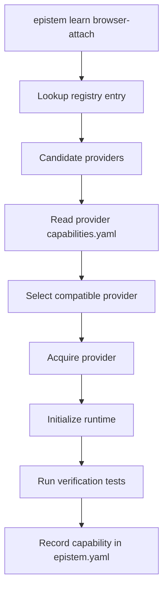

# Architecture

Epistem is organized around capabilities, not packages.

## Core Model

- **Capability**: the stable public contract a user asks for, such as `browser-attach`.
- **Provider**: a project that satisfies one or more capabilities through a `capabilities.yaml` manifest.
- **Registry**: a lightweight index that maps capabilities to candidate providers.
- **Runtime**: the lifecycle used to acquire, initialize, and verify a provider.
- **Verification**: startup and smoke tests that prove the provider is ready after installation.

## Phase 1 Flow

## Repository Layout

### `src/manifest`
Provider manifest schema, YAML parsing, and validation.

### `src/registry`
Capability-to-provider registry loading and embedded registry support.

### `src/provider`
Provider reference parsing and fetch helpers for local and GitHub sources.

### `src/reasoning`
Deterministic provider selection and environment checks.

### `src/runtime`
Runtime launch, readiness checks, and shutdown handling.

### `src/verification`
Verification suite parsing and execution.

### `src/learn`
The end-to-end orchestration pipeline for `epistem learn`.

### `src/cli`
Command-line entry points for `init`, `validate`, `learn`, and graph inspection.

### `src/storage`
Filesystem adapter used to load installed providers.

### `src/utils`
Filesystem path helpers and shared utilities.
